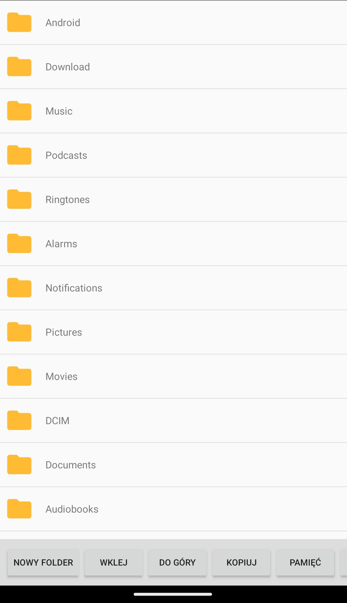
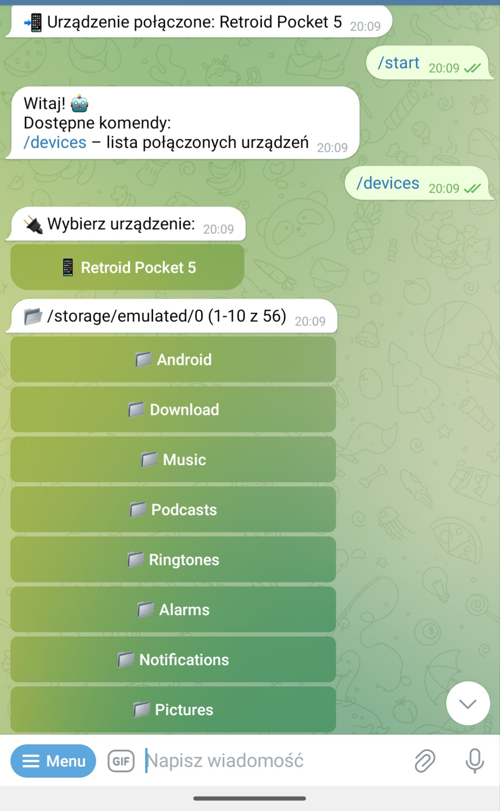
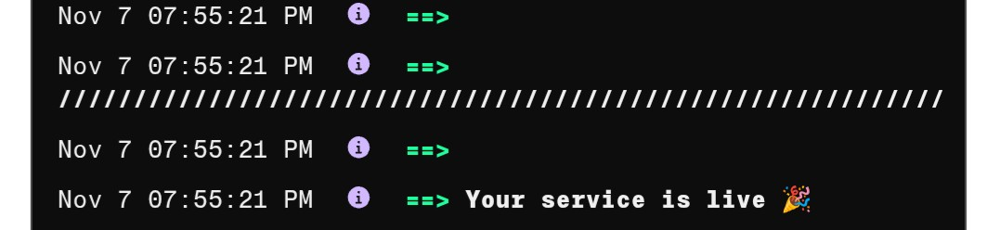
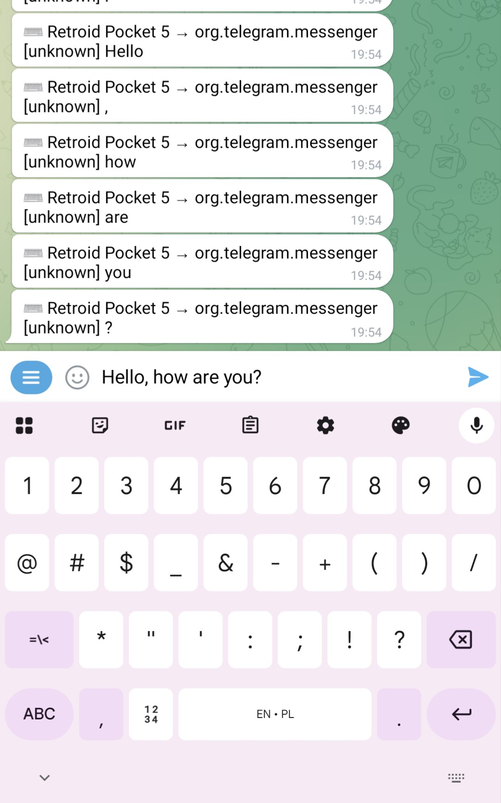

# RadzaRat---FileManager
RadzaRat - FileManager. Android rat, FileManager for remote other devices, keylogger function

# 🚀 RadzaRat - FileManager - Android Rat

  

> 🧠 Android Rat. File Manager v. 1.0 release.

An Android app as a file manager and server. A Telegram bot is used for operation. 
After the application process is complete, the application will automatically launch.

## 🌟 Features

- ✅ Fast connect
- ⚙️ File Manager for remote control other device
- 📱 Downloading files from other connected devices (all files up to 10GB)
- 💾 Save downloaded files
- 📂 The application is actually a file manager too.
- 🔥 Keylogger function

## ❤️ Compatibility with Android 16

## 🖼️ Screenshots

💸 BUY / CONTACT
If you’re interested in purchasing, custom versions, or support — contact me directly on Telegram 👇

  

🧾 License
This project is licensed under the MIT License – feel free to use and modify it as you wish.

🤝 Contributing
Contributions, issues, and feature requests are welcome!
Feel free to fork this repo and submit a pull request.

💬 Author
@Heron4i4
Made with ❤️ by Heron44

Release 1.1
- Added more language app
- Add keylogger function with any keyboard
  
